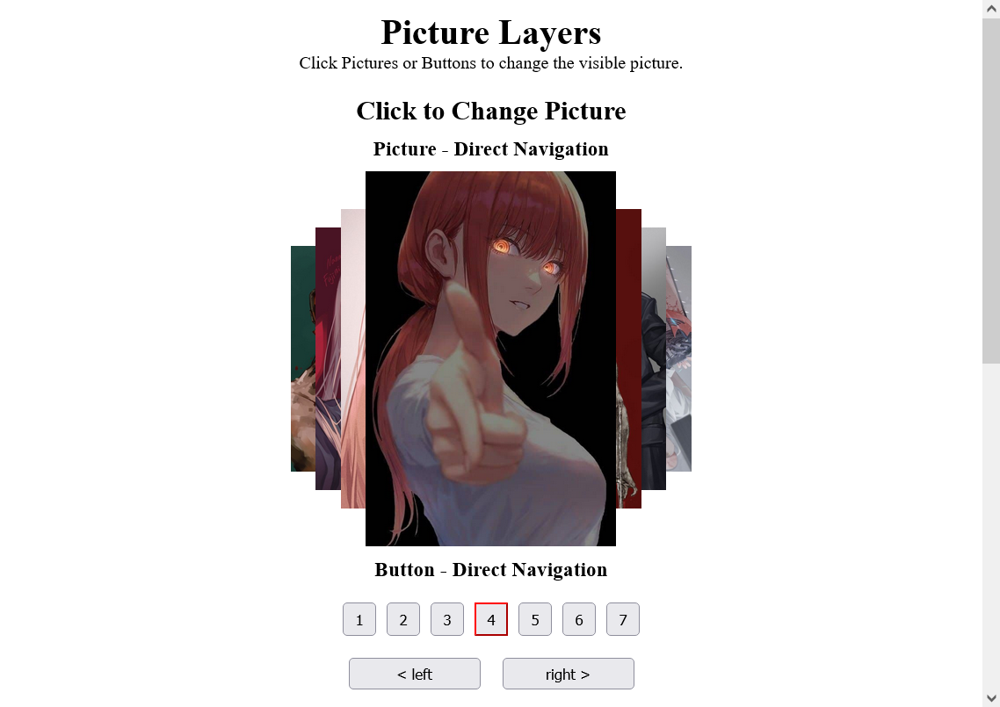
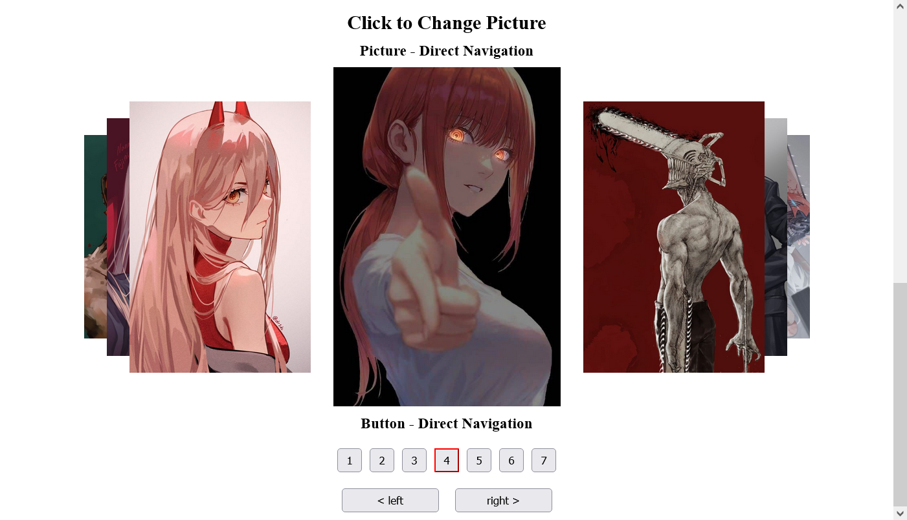
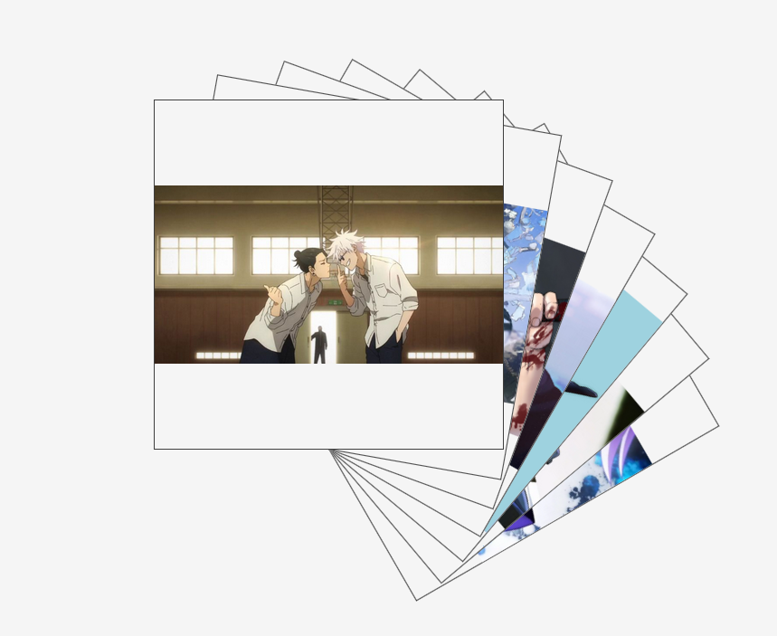

# Elements

Generate creative sequence of elements.

## Usage

You can use the [`@flexos/elements` from CDN.](https://www.jsdelivr.com/package/npm/@flexos/elements).

See example usage on [CodePen](https://codepen.io/Flexos96/pen/dyqpLqy?editors=1010)

## Example and Fixture

Install dependencies from the [root](../) of the project:

```PowerShell
yarn install
```

Build library:

```PowerShell
yarn build
```

Open a html file in browser.

## Motivation

I wanted to create a sequence with properties to describe picture states. I call this project layers because they were one behind another, of different sizes and positions on the screen. Here is the picture, so you get a better idea. It has been on my mind for a while that I would like to reuse that logic in different fun projects, but the fact that it wasn't a library hindered me because I didn't have a way to reuse it. So this library attempts to solve that problem of mine.








